# Codex CLI 与 Claude Code 的 Agent Harness 架构比较研究

## 执行摘要
两者都属于“Agent Harness（智能体运行框架）+ 远端模型推理”的体系，但工程侧重不同：Codex 以“核心运行时 + App Server（JSON-RPC 事件流协议）”为中心，强调把智能体状态机与 UI 解耦并标准化事件原语；Claude Code 以“权限/策略驱动的本地执行 + 可打包分发的扩展层（plugins/hooks/skills/MCP）”为中心，强调把团队治理、可观测性与可复用扩展做成一等能力。两者底层模型细节多由供应商控制或未公开，本文聚焦智能体本身的系统架构与可二次开发接口。 citeturn5view1turn5view0turn12view2turn14view2turn19view0

## 范围界定与资料方法
本文把“Agent 架构”限定为：任务/会话状态机、工具编排、上下文构建与压缩、记忆与持久化、权限与沙箱、扩展/插件体系、事件流与对外协议、可观测性与治理。这意味着诸如“模型参数规模、Transformer 编解码细节、训练与微调流程”等不展开：即便文档偶尔提到可选模型，这也属于“可配置推理后端”，而非 harness 的核心结构；相关细节如无权威公开材料，将在“未公开信息”章节标注。 citeturn12view0turn5view1turn9view3turn19view0

资料优先级按“官方文档/官方工程博客/开源仓库”排序，其次才引用第三方解读或基准。为满足“链接与发布日期”要求：若页面明确标注发布日期则直接引用；若未标注，则以“访问日期（2026-03-20）”补充，并仍以官方为准。 citeturn5view1turn8view0turn11view2turn18search2turn16view2

## Codex CLI 的 Agent Harness 架构剖析
### 分层结构与“App Server 化”的智能体运行时
Codex 的关键架构点是把智能体循环与 UI 显式分离：官方将核心智能体逻辑称为 “Codex core”，并通过一个长期运行进程（App Server）托管多个“线程（thread）”的会话运行时，再由不同客户端以协议方式接入。来源：entity["company","OpenAI","ai research company"] 工程博客《Unlocking the Codex harness: how we built the App Server》（2026-02-04，链接：`https://openai.com/index/unlocking-the-codex-harness/`）。 citeturn5view1

App Server 既是“进程形态的运行时”，也是“对外协议”：它使用双向 JSON-RPC 2.0（线传可省略 jsonrpc 头），默认通过 stdio 以 JSONL 流式传递消息，也提供实验性的 WebSocket 传输；并在 WebSocket 模式下采用有界队列、过载拒绝（-32001）与建议的指数退避。来源：Codex 开发者文档《App Server》（未标注发布日期，访问于2026-03-20，链接：`https://developers.openai.com/codex/app-server/`）以及开源仓库 `codex-rs/app-server/README.md`（访问于2026-03-20，链接：`https://github.com/openai/codex/blob/main/codex-rs/app-server/README.md`）。 citeturn5view0turn16view1

对二次开发而言，这种“App Server 化”的意义在于：你不必复刻复杂的 agent 交互（一次请求对应多步行动与流式输出），而是订阅稳定的事件流，并按 thread/turn/item 原语渲染 UI 与控制审批。官方强调：一次客户端请求会产生许多事件更新，这些事件是构建富 UI 的基础；同时协议支持 server-initiated request（例如审批）并可暂停 turn 直至客户端响应。来源：同上工程博客与 App Server 文档。 citeturn5view1turn16view1turn5view0

### 会话状态机：Thread / Turn / Item 与事件生命周期
Codex 把一次交互抽象为三层原语：Thread（对话线程）、Turn（一次用户触发的工作回合）、Item（回合中输入/输出的原子事件，如用户消息、工具执行、diff、审批请求等），并为 item 定义 started → delta(可选) → completed 的生命周期，这让 UI 能够“先渲染占位、再增量更新、最后落盘定稿”。来源：官方工程博客（2026-02-04，链接同上）与 app-server README 的 Core Primitives/Lifecycle 段落。 citeturn5view1turn16view1

这种显式事件编排，也体现在“初始化握手 + 能力协商”上：客户端需先 `initialize`，再发 `initialized` 通知，之后才能 `thread/start`、`turn/start` 并持续读取通知流；官方甚至提供 schema 生成命令（TypeScript/JSON Schema），且输出与版本绑定，用于避免“协议实现与版本漂移”。来源：Codex Developers《App Server》（访问于2026-03-20，链接同上）与仓库 README。 citeturn5view0turn16view1

### Agent Loop：上下文构建、工具列表、SSE 流与内部事件再发布
从“智能体循环”角度，OpenAI 在中文工程文章《深入解析 Codex 智能体循环》（2026-01-23，链接：`https://openai.com/zh-Hans-CN/index/unrolling-the-codex-agent-loop/`）给出了非常接近参考实现级别的描述：Codex 在向 Responses API 发起请求前，会构建 `tools` 列表（含本地 `shell`、计划工具、以及 web_search/MCP 工具等），并在 `input` 中预插入多类消息（权限说明 developer message、聚合的用户指令 user message、环境上下文等），然后以 SSE 事件流接收模型输出，再把 SSE 事件转换为内部事件并追加到 `input` 供下一轮调用。 citeturn8view0turn9view3turn9view4

该文还揭示了一个对“Agent 工具安全边界”极关键的事实：Codex 的 OS 沙箱“只约束由 Codex 提供的 shell 工具”，而来自 MCP 的第三方工具不受 Codex 沙箱限制，需要各自实现防护。来源：同文关于 `input` 初始化与权限说明的段落（中文工程文章）。 citeturn9view3turn9view2

对二次开发的启示是：Codex 的“工具能力扩展（MCP）”与“安全隔离（OS sandbox）”不是天然同一层；如果你要把 Codex 当作通用 agent runtime，需要对第三方工具的权限体系/审计体系另建“第二道闸”。 citeturn9view2turn8view1

### 上下文管理：AGENTS.md 指令链、技能渐进加载、压缩与提示缓存工程
Codex 的“项目指令”采用 AGENTS.md 机制：启动时构建 instruction chain，按全局（`~/.codex`）到项目根再到工作目录逐级发现，并支持 `AGENTS.override.md` 覆盖、以及 fallback 文件名；每个目录最多纳入一个文件。来源：Codex Developers《Custom instructions with AGENTS.md》（未标注发布日期，访问于2026-03-20，链接：`https://developers.openai.com/codex/guides/agents-md/`）。 citeturn5view3

“技能（skills）”层面，Codex 采用渐进披露：启动时仅加载技能元数据（name/description/path 等），真正读取 SKILL.md 仅在决定使用该技能时发生，从而控制上下文占用。来源：Codex Developers《Agent Skills》（未标注发布日期，访问于2026-03-20，链接：`https://developers.openai.com/codex/skills/`）。 citeturn8view3

更深入的是提示缓存与压缩：在《深入解析 Codex 智能体循环》中，OpenAI 直接讨论了为了保持 prompt cache 命中而必须保持工具枚举顺序稳定、并在配置变化时通过“追加新消息而非修改旧消息”来降低缓存失效；同时在上下文接近阈值时进行压缩，早期依赖 `/compact` 的“总结式压缩”，后续引入 `/responses/compact` 专用端点，Codex 在超过 `auto_compact_limit` 时可自动调用。来源：该中文文章相关段落。 citeturn9view0turn9view3

### 权限与沙箱：双层控制（Sandbox mode + Approval policy）
Codex 的运行安全来自两层：Sandbox mode 决定“技术上能不能做”，Approval policy 决定“什么时候必须停下来问你”。默认本地运行网络关闭，且采用 OS 强制沙箱把可写范围限制到当前 workspace；云侧则运行在隔离容器中并采用“两阶段运行时”（setup 可联网安装依赖，agent 阶段默认离线，且 secrets 仅在 setup 可用并在 agent 阶段前移除）。来源：Codex Developers《Agent approvals & security》（未标注发布日期，访问于2026-03-20，链接：`https://developers.openai.com/codex/agent-approvals-security/`）。 citeturn8view1

该文还明确了本地 OS 沙箱实现差异（macOS Seatbelt、Linux bubblewrap/seccomp/可选 Landlock、Windows 原生/WSL），以及 web search 的 cached/live/disabled 模式：默认 cached 使用 OpenAI 维护的预索引结果以降低 prompt injection 风险，而 full access 模式下可能默认 live。来源同上。 citeturn8view1

### 子智能体与并发：受控的“线程扇出”
Codex 将 subagents 视为“并发工作线程”：通过 `agents.max_threads`（默认 6）限制并发 open threads，通过 `agents.max_depth`（默认 1）限制嵌套深度，并警告提高深度会增加 token、延迟和本地资源消耗风险。来源：Codex Developers《Subagents》（未标注发布日期，访问于2026-03-20，链接：`https://developers.openai.com/codex/subagents/`）与配置参考中对 agents.* 解释。 citeturn15search1turn8view4

这类“显式并发上限 + 深度上限”的设计，属于典型 agent harness 的“可控扇出（controlled fan-out）”模式：既支持并行探索/执行，又避免不受控递归导致预算失控。 citeturn15search1turn8view4

### 可观测性：OTel 事件/指标与 App Server 健康检查
Codex 的可观测性以 OpenTelemetry 为中心：Advanced Config 明确 OTel log export 默认关闭、需显式 opt-in；可配置 exporter（otlp-http / otlp-grpc）、并强调 `log_user_prompt=false` 以默认脱敏；同时列出了 codex.api_request、codex.tool.call 等事件/直方图指标，并说明 exporter 异步批量发送、退出时 flush。来源：Codex Developers《Advanced Configuration》（未标注发布日期，访问于2026-03-20，链接：`https://developers.openai.com/codex/config-advanced/`）。 citeturn8view2

在 App Server 侧，仓库 README 还提供 `GET /readyz`、`GET /healthz` 健康探针，以及 `RUST_LOG` 与 JSON 格式日志输出建议，这使得 Codex core 能以“标准进程 + 探针 + 结构化日志”的方式嵌入更大的系统。来源：`codex-rs/app-server/README.md`（访问于2026-03-20，链接同上）。 citeturn16view1

## Claude Code 的 Agent Harness 架构剖析
### 核心定位：Harness 把“模型”变成“会行动的编码智能体”
Claude Code 的官方“How Claude Code works”文档把 harness 的职责说得非常直接：智能体循环由“模型（reason）+ 工具（act）”组成，而 Claude Code 作为 harness 提供工具、上下文管理与执行环境，使模型成为能完成任务的 coding agent。来源：Claude Code Docs《How Claude Code works》（未标注发布日期，访问于2026-03-20，链接：`https://code.claude.com/docs/en/how-claude-code-works`）。 citeturn12view1

其 agent loop 被描述为三段：gather context → take action → verify results，并允许用户在任何时刻打断与引导。这属于“验证驱动（verification-in-the-loop）”的典型 agent 形态：工具执行结果持续回流，直到任务完成。来源同上。 citeturn12view1

### 工具体系：内建工具 + 被治理的扩展层
Claude Code 将工具做成可枚举、可授权、可被 hook/子智能体复用的“参考表”，并把权限要求绑定到工具。其 tools reference 列出如 `Read`、`Edit`、`Bash`、`Grep/Glob`、`WebFetch/WebSearch`、`Skill`、`Agent(子智能体)`、以及 `ToolSearch`（用于启用“工具搜索/延迟加载”时加载 deferred tools）等。来源：Claude Code Docs《Tools reference》（未标注发布日期，访问于2026-03-20，链接：`https://code.claude.com/docs/en/tools-reference`）。 citeturn14view1

扩展层的分工在《Extend Claude Code》中被系统化：  
CLAUDE.md 提供每会话持久上下文；Skills 提供可复用工作流；MCP 连接外部服务；Subagents 在隔离上下文中运行自身 loop 并返回摘要；Hooks 在 loop 之外以确定性脚本运行；Plugins 则打包分发这些能力。来源：Claude Code Docs《Extend Claude Code》（未标注发布日期，访问于2026-03-20，链接：`https://code.claude.com/docs/en/features-overview`）。 citeturn14view2

对“Agent 架构学习”而言，这种明确的“分层扩展模型”非常关键：它把“上下文注入、能力注入、外部工具接入、确定性自动化、可分发封装”拆成可组合模块，避免把一切塞进 system prompt 或单体插件。 citeturn14view2turn5view6

### 记忆与上下文：CLAUDE.md + 自动记忆 + 压缩策略
Claude Code 的“跨会话记忆”由两套机制组成：你写的 CLAUDE.md（项目/用户/组织范围）与 Claude 自动写的 auto memory；两者都在会话开始加载，但被视为“上下文”而非强制配置。中文版文档《Claude 如何记住您的项目》明确列出了作用域位置（如 `~/.claude/CLAUDE.md`、项目 `./CLAUDE.md`、以及托管策略路径），并指出 auto memory 每次仅自动加载前 200 行。来源：Claude Code Docs（zh-CN）《memory》（未标注发布日期，访问于2026-03-20，链接：`https://code.claude.com/docs/zh-CN/memory`）。 citeturn11view3

在“上下文窗口填满”时，Claude Code 的处理路径是：优先清理旧的工具输出，再在必要时总结对话；并建议把持久规则放进 CLAUDE.md。其英文 How-it-works 文档还指出：MCP servers 会把工具定义带入每次请求，可能在开始工作前就占用显著上下文，因此提供 `/mcp` 查看成本、`/context` 查看占用。来源：Claude Code Docs《How Claude Code works》（同上链接）。 citeturn12view4turn12view1

这与 Codex 在工程文中强调的“缓存命中与压缩端点”形成对照：Claude Code 的公开叙述更偏策略层与用户可控接口（/context、Compact Instructions），而 Codex 的公开叙述更偏“请求构造与缓存工程”。 citeturn12view4turn9view0turn16view1

### 权限与安全：以“权限为中心”的架构 + 沙箱化 Bash
Claude Code 的安全文档把体系称为“Permission-based architecture”：默认严格只读；当需要编辑文件、运行测试、执行命令时请求显式许可，并允许用户选择一次性批准或自动放行。来源：Claude Code Docs《Security》（未标注发布日期，访问于2026-03-20，链接：`https://code.claude.com/docs/en/security`）。 citeturn19view0

其内建保护包含：Bash 工具沙箱（文件系统/网络隔离）、写入范围限制（默认仅能写入启动目录及子目录）、常用安全命令 allowlist、Accept Edits 批量接受等；并在防 prompt injection 部分列出 command blocklist（默认阻止 curl/wget 等抓取任意网页内容）、命令注入检测、fail-closed 匹配策略等。来源同上。 citeturn19view0

权限规则的一个工程细节也值得注意：permissions 文档解释“批准一个 compound command 时，会为每个需要审批的子命令保存独立规则”，并指出 Bash 参数模式脆弱，建议用 deny curl/wget + WebFetch(domain=...) 或 PreToolUse hooks 校验 URL。来源：Claude Code Docs《Configure permissions》（未标注发布日期，访问于2026-03-20，链接：`https://code.claude.com/docs/en/permissions`）。 citeturn19view1

这体现了 Claude Code 的 harness 设计哲学：把“长期可维护的安全策略”落到可版本控制的规则与 hooks，而不是依赖模型“记得”安全约束。 citeturn19view1turn5view8

### 会话与可回滚状态：本地持久化 + Checkpointing
Claude Code 把“会话可继续性”做成 harness 的默认能力：每条消息与工具结果会被保存为会话记录，从而支持 resume/fork；并引入 checkpoints 机制，在每次 edit 前捕获代码状态，允许 Esc Esc 或 `/rewind` 回滚“代码/对话/两者”，或从某点起总结以释放上下文。来源：Claude Code Docs《How Claude Code works》与《Checkpointing》。链接分别为 `https://code.claude.com/docs/en/how-claude-code-works` 与 `https://code.claude.com/docs/en/checkpointing`（均未标注发布日期，访问于2026-03-20）。 citeturn12view4turn19view2

Checkpointing 文档还明确了边界：它只跟踪由“文件编辑工具”产生的变更，不跟踪 bash 命令修改的文件，因此不是版本控制替代品。来源同上。 citeturn19view2

从 agent 架构角度，这相当于在“工具层”之上增加了一层“可逆性控制（reversibility control plane）”：对用户而言，允许更激进的自动化；对二次开发而言，提示你在设计工具集时最好区分“可回滚 edits”与“不可回滚 side effects”。 citeturn19view2turn19view0

### 子智能体：隔离上下文窗口的专用 worker
Claude Code 的 subagents 文档把子智能体定义为“在独立上下文窗口中运行，拥有自定义 system prompt、工具访问与独立权限”的专用 assistant；并强调可用于保持主对话上下文干净、用工具限制强制约束、以及将任务路由到更快/更便宜的模型（此处属于推理后端选择，本文不展开）。来源：Claude Code Docs《Create custom subagents》（未标注发布日期，访问于2026-03-20，链接：`https://code.claude.com/docs/en/sub-agents`）。 citeturn14view0

该文也给出 subagent 的层级与来源优先级（CLI flag、项目 `.claude/agents/`、用户 `~/.claude/agents/`、插件内 agents/），并指出出于安全原因，插件提供的 subagent 不支持 hooks/mcpServers/permissionMode frontmatter（会被忽略），需要复制到项目或用户目录才能启用这些高权限能力。来源同上。 citeturn14view0

这是一种非常“治理优先”的扩展模型：可分发的插件被限制高风险能力，组织可通过受控路径启用更强的 hooks/MCP/权限，从而降低供应链风险。 citeturn14view0turn19view0

### 执行环境：Local / Cloud / Remote Control 与会话迁移
Claude Code 明确区分三种执行环境：本地、云端（Anthropic 托管 VM）、Remote Control（浏览器控制本地进程）。其 Security 文档进一步解释：web 端用隔离 VM、网络域控制、代理化 GitHub 凭证、审计日志与自动清理；Remote Control 则不使用云 VM，执行仍在本地，数据经 TLS 走 API。来源：Claude Code Docs《Security》与《Claude Code on the web》。后者未标注发布日期，访问于2026-03-20，链接：`https://code.claude.com/docs/en/claude-code-on-the-web`。 citeturn19view0turn19view3

在《Claude Code on the web》中，还给出了 terminal↔web 的任务迁移接口（`--remote` 创建云会话、`--teleport` 拉回到本地），并声明 web sessions 即使关机也可持续；同时描述云环境准备流程（clone repo、运行 setup script、配置网络、执行并 push 分支）。来源同上。 citeturn19view3turn19view0

## 关键维度对比与工程影响
### 结构性差异：协议中心 vs 治理中心
Codex 的“agent 本体”更像一个可被嵌入的运行时组件：App Server 把内部细粒度事件（item/turn）面向客户端稳定化，并提供 schema 生成、健康检查、背压语义与 server-initiated approvals，这非常适合把 Codex 作为通用“agent kernel”嵌入其他产品。来源：OpenAI 工程博客（2026-02-04）与 app-server README/文档。 citeturn5view1turn16view1turn5view0

Claude Code 的“agent 本体”更像一个在本地强治理的“可扩展开发工作台”：它把权限体系、checkpoint 回滚、分层配置（managed/user/project/local）、hooks 与 plugins 视为核心组成，让组织可以把 harness 当作可控的执行器与审计对象。来源：Settings（zh-CN）、Security、Checkpointing、Hooks、Plugins reference。链接分别为 `https://code.claude.com/docs/zh-CN/settings`、`https://code.claude.com/docs/en/security`、`https://code.claude.com/docs/en/checkpointing`、`https://code.claude.com/docs/en/hooks`、`https://code.claude.com/docs/en/plugins-reference`（均未标注发布日期，访问于2026-03-20）。 citeturn11view2turn19view0turn19view2turn5view8turn5view9

### 工具安全边界：MCP 与沙箱/权限的耦合方式不同
Codex 明确指出 OS 沙箱主要约束其自带 shell 工具，MCP 工具不自动受沙箱保护；因此“扩展工具”天然带来新的 trust boundary。来源：Codex 智能体循环中文工程文。 citeturn9view2turn8view1

Claude Code 则把 MCP 纳入权限与治理叙事：安全文档称“新 MCP server 需要信任验证”，并在 permissions 文档中把 MCP 工具纳入 rule syntax（如 `mcp__server__tool`）；同时支持用 hooks 进一步拦截工具调用。来源：Security、Permissions、Hooks。 citeturn19view0turn19view1turn5view8

### 并发与子智能体：Codex 用“线程上限/深度上限”，Claude Code 用“隔离上下文 + 受限来源”
Codex 的并发控制偏 runtime 参数：`agents.max_threads` 与 `agents.max_depth` 是全局上限，强调避免递归 fan-out。来源：Codex Subagents 文档与 config reference。 citeturn15search1turn8view4

Claude Code 的并发控制偏工作流与治理：subagent 天然隔离上下文，插件来源 subagent 被限制 hooks/mcpServers/permissionMode，从分发链路削弱风险；并可通过 permissions 规则控制可用 subagent。来源：Create custom subagents 与 permissions。 citeturn14view0turn19view1

### 端到端性能/成本：公开指标有限，主要来自“请求/事件工程”与“上下文经济”
两者都强调上下文成本：Codex 公开讨论 prompt cache 命中与工具枚举顺序、以及 `/responses/compact` 自动压缩；Claude Code 公开提供 `/context`、工具搜索（deferred tools）与“先清理工具输出再总结”的策略，并提示 MCP server 工具定义会持续占用上下文。来源：Codex 智能体循环文与 Claude Code how-it-works。 citeturn9view0turn12view4turn14view1

两者都支持 OpenTelemetry：Codex 在 config-advanced 中给出事件与指标清单；Claude Code 在 monitoring usage 文档中说明通过 OTel 导出 metrics 与 events/logs，用于追踪 usage、cost 与 tool activity。来源：Codex Advanced Config 与 Claude Code Monitoring。链接：`https://developers.openai.com/codex/config-advanced/`、`https://code.claude.com/docs/en/monitoring-usage`（均未标注发布日期，访问于2026-03-20）。 citeturn8view2turn5view4

### 关键对比表
下表将“推理延迟/吞吐/成本”解释为 **Agent Harness 侧** 的端到端特性（事件流、上下文压缩、并发/阻塞、治理带来的交互开销等），不剖析模型本身；缺乏官方量化处以“未公开”，必要处给出“推断”。 citeturn5view1turn12view4turn8view2turn19view0

| 维度 | Codex CLI（含 App Server） | Claude Code |
|---|---|---|
| 架构组件 | 核心运行时“Codex core”+ App Server（长期进程）+ 多客户端；以 thread/turn/item 事件流对外统一。来源：`https://openai.com/index/unlocking-the-codex-harness/`（2026-02-04）。 citeturn5view1turn16view1 | 本地 harness（工具/上下文/执行环境）+ 分层配置与治理 + 扩展层（skills/subagents/hooks/MCP/plugins）。来源：`https://code.claude.com/docs/en/how-claude-code-works`（访问2026-03-20）。 citeturn12view1turn14view2 |
| 推理延迟（端到端） | 未公开。架构上通过 SSE 流与 item delta 支持细粒度流式 UI；并通过 prompt cache/追加消息策略减少重算（推断：可显著影响交互延迟）。来源：`https://openai.com/zh-Hans-CN/index/unrolling-the-codex-agent-loop/`（2026-01-23）。 citeturn9view4turn9view0turn16view1 | 未公开。架构上同样强调流式交互与自动 compaction；提供 /context 与工具搜索以控制上下文膨胀（推断：减少长会话尾延迟）。来源：`https://code.claude.com/docs/en/how-claude-code-works`（访问2026-03-20）。 citeturn12view4 |
| 吞吐（并发/多任务） | App Server 可同时持有多 thread，并对请求过载给出 backpressure 语义；subagents 用 max_threads/max_depth 控制 fan-out。来源：`https://github.com/openai/codex/blob/main/codex-rs/app-server/README.md`（访问2026-03-20）与 `https://developers.openai.com/codex/subagents/`（访问2026-03-20）。 citeturn16view1turn15search1 | 通过 subagents 的隔离上下文与后台任务（Task* 工具）组织并行；web 端可用 `--remote` 启动多个独立云会话。来源：`https://code.claude.com/docs/en/tools-reference` 与 `https://code.claude.com/docs/en/claude-code-on-the-web`（访问2026-03-20）。 citeturn14view1turn19view3 |
| 可扩展性 | MCP（stdio/streamable HTTP）、skills（渐进加载）、可将 Codex 本身作为 MCP server；AGENTS.md 指令链。来源：`https://developers.openai.com/codex/mcp/`、`https://developers.openai.com/codex/skills/`、`https://developers.openai.com/codex/guides/agents-md/`（均访问2026-03-20）。 citeturn5view2turn8view3turn5view3 | skills + subagents + hooks + MCP + plugins；插件可打包分发并有 manifest/默认发现；并支持 managed settings 做组织级治理。来源：`https://code.claude.com/docs/en/features-overview`、`https://code.claude.com/docs/en/plugins-reference`、`https://code.claude.com/docs/zh-CN/settings`（访问2026-03-20）。 citeturn14view2turn5view9turn11view2 |
| 部署复杂度 | 若只用 CLI：低；若深度集成：需要实现 JSON-RPC 客户端并消费事件流，但官方提供 schema 生成与稳定 API/实验 API 分层（推断：工程可控）。来源：`https://developers.openai.com/codex/app-server/`（访问2026-03-20）。 citeturn5view0turn16view1 | 本地使用低；组织治理与插件市场/managed policy 配置上升；web/cloud/teleport 增加环境与凭证治理复杂度。来源：Settings、Security、Claude Code on the web（访问2026-03-20）。 citeturn11view2turn19view0turn19view3 |
| 成本估计范围（工程成本） | （推断）若把 Codex 当“agent kernel”嵌入：需要实现协议层、事件存储/渲染与审批 UI，但可复用 app-server 语义；典型为 2–6 人周/原型、6–12 人周/稳定集成（依赖 UI 复杂度）。依据：协议/事件复杂度公开且可生成 schema。 citeturn16view1turn5view1turn5view0 | （推断）若以 Claude Code 生态二开：往往通过写入 .claude/（skills/agents/hooks/settings）与插件机制实现，原型快（1–3 人周），但要做组织级治理、市场分发、hook/权限策略审计时成本上升（4–10 人周）。依据：插件/配置/managed scope 公开且细粒度。 citeturn5view9turn11view2turn19view0 |
| 隐私/合规性（harness 侧） | 企业文档强调 enterprise 安全特性与审计/加密等（具体对 CLI/IDE 的数据保留策略以企业配置为准）。来源：`https://developers.openai.com/codex/enterprise/admin-setup/`（未标注发布日期，访问2026-03-20）。 citeturn6search25 | Security 文档列出保留期限制、敏感信息访问控制、凭证加密存储，并强调权限与审计。来源：`https://code.claude.com/docs/en/security`（访问2026-03-20）。 citeturn19view0 |
| 可定制性 | 强项在“外部协议 + 配置/技能/AGENTS/MCP”组合，且可把 Codex 作为 MCP server 供其他 agent 调用。来源：Codex MCP 与 Agents SDK guide（访问2026-03-20）。 citeturn5view2turn3search20turn16view1 | 强项在“可版本控制的本地行为层”（settings/permissions/hooks/skills/subagents）与可分发插件。来源：Settings、Hooks、Plugins reference（访问2026-03-20）。 citeturn11view2turn5view8turn5view9 |

## 图示
### 架构对比图
```mermaid
flowchart LR
  subgraph A[Codex CLI / Codex Harness]
    U1[User/IDE/CLI UI] -->|JSON-RPC (stdio JSONL)\nthread/turn/item events| AS[App Server Process<br/>(long-lived)]
    AS --> CORE[Codex core runtime<br/>agent loop + thread manager]
    CORE -->|HTTP POST| RAPI[Responses API<br/>(remote inference)]
    RAPI -->|SSE stream| CORE
    CORE -->|tool calls| SH[Built-in shell tool<br/>OS sandbox enforced]
    CORE -->|tool calls| MCP1[MCP tools<br/>(trust boundary)]
    CORE -->|local persistence| SESS1[Local transcripts / resume/fork]
  end

  subgraph B[Claude Code Harness]
    U2[User/Terminal/IDE/Web UI] --> CC[Claude Code process<br/>agentic harness]
    CC -->|model API| CAPI[Anthropic model API<br/>(remote inference)]
    CC --> TOOLS[Built-in tools<br/>Read/Edit/Grep/Bash/WebFetch...]
    CC --> EXT[Extension layer<br/>CLAUDE.md + auto memory + skills<br/>subagents + hooks + MCP + plugins]
    CC -->|checkpointing| CKPT[Checkpoints / rewind]
    CC -->|local persistence| SESS2[Local sessions / resume/fork]
    CC -->|optional| CLOUD[Cloud VM sessions (--remote)\nteleport back to local]
  end
```
图中 Codex 的关键差异是“App Server 作为独立进程 + 标准事件流协议”，Claude Code 的关键差异是“以本地 harness 为中心，把治理（权限/回滚/分层配置/插件）内建”。来源：Codex App Server 工程博客与文档、Claude Code how-it-works/security/web 文档。 citeturn5view1turn5view0turn16view1turn12view1turn19view0turn19view3

### 性能/成本对比图
下图给出 **二次开发视角** 的“工程成本与交互开销”相对量化（0–10，越高代表越大），属于基于公开架构复杂度的“推断”，用于帮助你把注意力放在 harness 设计差异上，而非模型推理优劣。依据：Codex 需要实现 JSON-RPC 协议并消费细粒度事件流；Claude Code 需要治理/插件/权限策略与回滚机制的理解与落地。 citeturn16view1turn11view2turn19view2turn19view0turn12view4

```mermaid
xychart-beta
  title "Agent Harness 二次开发：相对复杂度（推断，0-10）"
  x-axis ["协议/集成复杂度","治理/策略复杂度","长会话上下文工程","可回滚/状态管理","扩展分发与生态"]
  y-axis "score" 0 --> 10
  bar "Codex (App Server 중심)" [8,5,8,6,6]
  bar "Claude Code (治理/插件 중심)" [5,9,7,9,8]
```



## 未公开信息与不确定性
以下信息要么官方未公开、要么公开材料不足以形成可验证结论，因此对“架构优劣”判断会引入不确定性；本文在对比表与结论中已尽量避免依赖这些点。

Codex 方面：  
其一，Codex core 内部状态机细节（除 thread/turn/item 原语外的调度策略、错误恢复、speculative execution 等）未以完整设计文档形式公开；我们只能从 App Server 协议与工程文章推断其以事件流驱动 UI 与审批。 citeturn5view1turn16view1turn5view0  
其二，提示缓存命中率、压缩触发阈值默认值、以及不同工具组合对端到端延迟/成本的量化影响，官方仅给出机制与工程注意事项，缺少统一 benchmark；因此本文对“性能”只讨论机制，不给绝对数值。 citeturn9view0turn8view2  
其三，第三方 MCP 工具的安全隔离与审计如何体系化，官方仅指出“非 shell 工具不受 Codex 沙箱限制”，但未给出“一体化安全框架”的强制规范；这会显著影响你在二开时的安全边界设计。 citeturn9view2turn8view1  

Claude Code 方面：  
其一，虽然文档清晰描述了权限体系、沙箱、command blocklist 与 fail-closed 设计，但“命令注入检测”的具体实现（规则、模型辅助、静态分析、还是混合）未公开到可审计级别；因此对其对抗绕过的强度只能视为“机制公开、实现细节未公开”。 citeturn19view0turn19view1  
其二，session 文件的具体存储格式、索引结构、与跨版本迁移策略并未在官方文档中系统化阐述（官方更强调用户层能力如 resume/fork/teleport）；这会影响你若要“直接读取/复用其会话状态”作为二开基础时的稳定性预期。 citeturn12view4turn19view3turn11view1  
其三，plugins marketplace/managed policy 的企业落地流程在文档层面较全，但其服务端策略下发与审计日志接口（尤其与企业身份系统集成）细节需要依赖具体产品计划与管理控制台能力，公开材料不足以完全复现。 citeturn11view2turn19view0turn5view4  

## 主要参考来源
为便于核查，下列列出本文最“承重”的官方来源（含链接与日期）。未标注发布日期者以访问日期代替。

OpenAI：
- 《Unlocking the Codex harness: how we built the App Server》（2026-02-04，`https://openai.com/index/unlocking-the-codex-harness/`；中文：`https://openai.com/zh-Hans-CN/index/unlocking-the-codex-harness/`）。 citeturn5view1turn7search3  
- 《深入解析 Codex 智能体循环》（2026-01-23，`https://openai.com/zh-Hans-CN/index/unrolling-the-codex-agent-loop/`）。 citeturn8view0turn9view0turn9view4  
- Codex Developers《App Server》（访问 2026-03-20，`https://developers.openai.com/codex/app-server/`）。 citeturn5view0  
- Codex Developers《Agent approvals & security》（访问 2026-03-20，`https://developers.openai.com/codex/agent-approvals-security/`）。 citeturn8view1  
- Codex Developers《AGENTS.md》《MCP》《Skills》《Advanced Configuration》《Subagents》（访问 2026-03-20，`https://developers.openai.com/codex/guides/agents-md/`、`https://developers.openai.com/codex/mcp/`、`https://developers.openai.com/codex/skills/`、`https://developers.openai.com/codex/config-advanced/`、`https://developers.openai.com/codex/subagents/`）。 citeturn5view3turn5view2turn8view3turn8view2turn15search1  
- 开源仓库（访问 2026-03-20）：`https://github.com/openai/codex` 与 `codex-rs/app-server/README.md`。 citeturn18search2turn16view1  

Anthropic：
- Claude Code Docs《How Claude Code works》《Tools reference》《Extend Claude Code》《Security》《Permissions》《Checkpointing》《Create custom subagents》《Claude Code on the web》《Monitoring usage》（访问 2026-03-20，分别为 `https://code.claude.com/docs/en/how-claude-code-works`、`https://code.claude.com/docs/en/tools-reference`、`https://code.claude.com/docs/en/features-overview`、`https://code.claude.com/docs/en/security`、`https://code.claude.com/docs/en/permissions`、`https://code.claude.com/docs/en/checkpointing`、`https://code.claude.com/docs/en/sub-agents`、`https://code.claude.com/docs/en/claude-code-on-the-web`、`https://code.claude.com/docs/en/monitoring-usage`）。 citeturn12view1turn14view1turn14view2turn19view0turn19view1turn19view2turn14view0turn19view3turn5view4  
- Claude Code Docs（zh-CN）《settings》《memory》（访问 2026-03-20，`https://code.claude.com/docs/zh-CN/settings`、`https://code.claude.com/docs/zh-CN/memory`）。 citeturn11view2turn11view3  
- 开源仓库（访问 2026-03-20）：`https://github.com/anthropics/claude-code`。 citeturn16view2