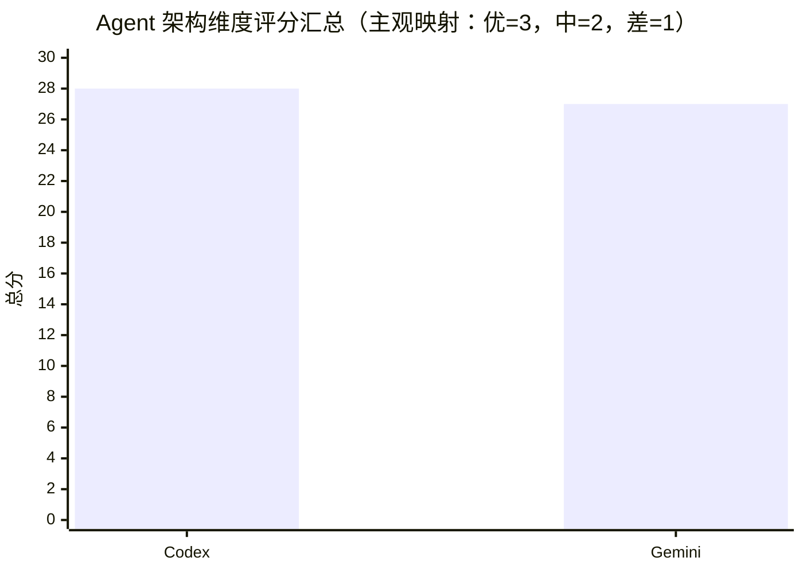

# Codex CLI 与 Gemini CLI 的 Agent 架构对比研究

## Executive Summary

在“终端里的编程 Agent”这一类产品形态下，Codex CLI（由 entity["company","OpenAI","ai company"] 主导开源）与 Gemini CLI（由 entity["company","Google","technology company"] 团队开源）都采用“模型—工具—反馈”的闭环：Codex 强调 **Plan→Edit→Run→Observe→Repair** 的工程化工作流与“安全默认”（默认无网络、沙箱+审批双层控制），并提供可复用的多客户端协议（app-server）。citeturn12view0turn27view5turn12view4 Gemini CLI则更像一个“可扩展的平台型 Agent 运行时”：以 ReAct 循环为核心，配合统一工具注册表 + MCP 发现/执行层、A2A 远程子 Agent（实验特性）、OpenTelemetry 可观测性、企业级集中配置与“受信任文件夹”治理。citeturn11search3turn29view1turn13view2turn13view3turn30view3

若必须给出“哪个设计更好”的结论：**以“安全可控 + 面向生产的多客户端嵌入 + 编程任务闭环稳定性”为主指标，Codex 的 Agent 架构更胜一筹**；以“生态扩展 + 可观测性/治理 + 远程编排”为主指标，Gemini CLI 更适合作为平台底座。两者差距主要不在“是否能做 Agent”，而在“协议化程度、安全默认、扩展治理、可观测性一体化”的取舍。citeturn12view4turn27view5turn30view3turn13view3

## 已知信息与未指定假设

已知信息（来自你的问题与官方仓库/文档可直接确认的事实）  
你关心的是 Codex-cli 与 Gemini-cli 的 **Agent 架构优劣**，比较维度覆盖模块职责、接口、状态、扩展、并发、错误恢复、安全、性能、可测试/可观测、运维复杂度。版本、语言、运行环境未指定且以主分支为准。citeturn22search13turn11search3

未指定与本文假设（按要求明确标注“未指定”）  
- 具体版本/提交：未指定；本文按两项目主分支（main/master）与其官方文档在 2026-03-24（America/Los_Angeles）可见内容分析。citeturn22search13turn11search27  
- 编程语言：未指定；但从仓库结构可见 Codex 的现行实现以 Rust 为主（旧版 TypeScript CLI 已标注为 legacy），Gemini CLI 为 TypeScript/Node.js 单仓多包。citeturn5view2turn24view0turn38view0  
- 运行平台（Windows/macOS/Linux、是否容器、是否企业代理）：未指定；因此安全与运维部分以“默认行为 + 可配置项”对比，不代入某一OS的细节配置成本。citeturn27view5turn30view0turn30view4  
- 目标场景（个人开发/CI/企业内网/离线环境）：未指定；结论会给出“更适用的场景分流”。

（补充说明）你要求“优先中文资料”但又要求“网络搜索不用中文来源”。本文遵循“官方/源码优先”，主要引用英文官方原文与源码；中文表达仅用于分析说明。

## 两者 Agent 架构概览

Codex 的核心工作流被官方明确描述为长期任务闭环：计划、修改代码、运行工具（测试/构建/Lint）、观察结果、修复失败、更新文档与状态并循环。citeturn12view0  
Gemini CLI 的官方定位则强调：它是开源终端 Agent，运行方式为 ReAct（Reason-and-Act）循环，利用内置工具与本地/远程 MCP servers 完成复杂开发任务。citeturn11search3turn29view1  

Codex 把“多客户端接入”视作一等公民：提供 app-server（JSON-RPC 2.0，stdio/WebSocket），面向 IDE 插件等富客户端，协议支持 turn 生命周期与事件流，并包含“服务过载”错误码与重试建议。citeturn12view4turn23view2  
Gemini CLI 则以“核心包（core）+ 终端UI（cli）+ 可插拔生态（extensions/skills/hooks/MCP/A2A）”构成平台：ToolRegistry 统一注册、命令式工具发现、MCP 发现层 mcp-client.ts、以及 LocalAgentExecutor 的循环执行器等组件形成“运行时骨架”。citeturn29view0turn29view1turn20view0turn38view0turn21view0  

```mermaid
flowchart LR
  subgraph Codex
    U1[User / CLI TUI] --> A1[Agent Loop]
    A1 --> TR1[Tool Registry]
    TR1 --> T1[Local Tools: exec/apply patch/files]
    TR1 --> MCP1[MCP Servers]
    A1 --> S1[Sandbox + Approval Policy]
    A1 --> H1[History/State (JSONL/SQLite)]
    C1[Rich Client] <--> AS1[app-server JSON-RPC]
    AS1 <--> A1
  end

  subgraph Gemini
    U2[User / Ink UI] --> A2[ReAct Loop Executor]
    A2 --> TR2[ToolRegistry]
    TR2 --> T2[Built-in Tools]
    TR2 --> DT2[Discovered Tools (discoveryCommand)]
    TR2 --> MCP2[MCP Tools/Resources/Prompts]
    A2 --> M2[Hierarchical Memory (GEMINI.md)]
    A2 --> SB2[SandboxManager]
    A2 --> OT2[OpenTelemetry]
    A2 --> A2A2[Remote Subagents (A2A, exp)]
  end
```

## 关键维度对比

**模块划分与职责**  
Codex 在架构上明显分为“Agent运行时（core）—工具系统（ToolRegistry/handlers）—安全控制（sandbox+approval）—多客户端协议（app-server）—可复用技能（skills）—上下文指导（AGENTS）”。其中 app-server 被定义为“为富客户端提供认证、历史、审批与流式事件”的接口，并且实现开源在仓库内。citeturn12view4turn23view2turn33view0turn32view0 工具侧采用 Rust 的 ToolHandler/ToolRegistry 抽象，既支持 function 工具也支持 MCP 工具，并把“是否可能产生副作用（is_mutating）”作为运行时决策输入。citeturn24view0turn25view1  
Gemini CLI 的职责拆分更偏“平台型单仓多包”：核心（packages/core）负责 agent loop、工具、MCP、资源/提示注册表、压缩与调度；UI（packages/cli）主要消费核心事件；a2a-server 提供远程 agent 相关能力；sdk 与 test-utils 辅助生态化与测试。citeturn15view0turn29view0turn38view0 这一拆分对“多能力并存”（工具、提示、资源、代理、遥测）更友好，但对“形成稳定外部协议面”依赖文档与约定（而非一个强协议层）。

**通信与接口设计**  
Codex 的“对外接口”强在协议化：app-server 明确采用 JSON-RPC 2.0（线上的 jsonrpc 头可省略），支持 stdio JSONL 与 WebSocket；并定义过载时拒绝请求的错误码与重试策略。citeturn12view4turn23view2 同时，Codex 与外部系统连接主要经 MCP；官方文档列出支持的 MCP 类型（stdio、本地进程；streamable HTTP）与认证方式（Bearer/OAuth）。citeturn12view3  
Gemini CLI 的“对外接口”更分散：MCP 是标准化接口，文档明确其发现层（mcp-client.ts）与执行层（mcp-tool.ts）、以及 Stdio/SSE/Streamable HTTP 三类传输。citeturn29view1turn21view0 另外它开始支持 A2A 远程子 Agent（实验），通过协议与远端服务对接。citeturn13view2 但在“UI↔核心”的稳定接口上，它更像内部API（如 ToolRegistry、MessageBus、调度器事件），虽然清晰但不如 Codex app-server 那样具有外部契约强度。citeturn29view0turn38view0  

**状态管理与上下文保持**  
Codex 的“持久指导 + 可审计”路径更完整：  
- 指导链：AGENTS.md 支持全局/项目分层、override 优先、按目录自根向下拼接，并有 `project_doc_max_bytes` 上限与 fallback 文件名机制。citeturn33view0turn28view2  
- 技能：skills 采用“渐进披露”，默认只注入元信息，只有决定使用时才加载完整 SKILL.md；且 skills 可在 repo/user/admin/system 多位置扫描。citeturn32view0  
- 历史/状态：高级配置中说明本地会话转录可持久化为 JSONL（可禁用/限额并触发压缩整理）。citeturn34search0 另外源码文档提到 SQLite 状态库位置由 `sqlite_home`/环境变量控制。citeturn22search1turn7view7  
Gemini CLI 的“上下文”主轴是层级记忆（GEMINI.md）：从全局到项目根/祖先目录再到子目录扫描，支持 `/memory show` 检查拼接顺序，还支持 `@path` 导入。citeturn26view0turn13view5 在运行时，LocalAgentExecutor 引入 ChatCompressionService（压缩）与 DeadlineTimer（超时），并将“等待用户确认的时间”从 agent 预算中扣除/返还，体现了对长任务执行稳定性的工程化处理。citeturn38view0 但它的“持久状态”更多是文件/配置层（例如 shell history 在 `~/.gemini/tmp/<project_hash>/shell_history`），相比 Codex 的“历史 JSONL +（可选）SQLite 状态DB”更轻。citeturn26view3turn7view7  

**插件/扩展机制**  
Codex 的扩展三件套在官方概念里被定义为互补：AGENTS（行为约束）、Skills（可复用工作流）、MCP（连接外部系统）。citeturn27view2turn33view0turn32view0turn12view3 技能还可声明依赖（例如通过 metadata 指定要用的 MCP server），以及显式/隐式触发策略。citeturn32view0  
Gemini CLI 的扩展面更广：  
- Skills 基于同一开放标准，强调“按需加载”，并通过 `activate_skill` 工具把技能内容拉入上下文。citeturn30view1turn29view0  
- MCP servers 支持资源/提示作为 slash commands，以及 server trust/allowlist/excluded 等治理。citeturn29view1turn13view1  
- Hooks 允许拦截工具执行等事件（官方给出“把日志写 stderr、stdout 只输出最终JSON”的约束），适合做审计/自动化周边。citeturn30view2  
因此：**Gemini 在扩展形态与生态治理工具上更像“平台”，Codex 更像“围绕编程闭环的标准化定制”**。  

**并发与任务调度**  
Codex 的并发主通道是“子 Agent 工作流”：官方明确它只在你显式要求时才启动，并会并行运行多个 agent 后汇总结果；同时提示并行写操作的冲突风险与 token 成本上升。citeturn12view1turn27view3turn27view4 更关键的是：Codex 在工具层引入“副作用工具门控”：ToolRegistry 在 dispatch 时若检测工具可能 mutating，会等待 tool_call_gate 放行，避免并发副作用导致状态竞态。citeturn24view0  
Gemini CLI 的并发更体现在“调度与隔离”：LocalAgentExecutor 在 create 时为每个 agent 派生 MessageBus 并克隆工具，形成工具/资源/提示注册表的隔离副本；同时显式防止 agent 递归调用子 agent（跳过同名工具），降低 multi-agent 失控风险。citeturn38view0 远程子 agent（A2A）虽提供扩展空间，但处于实验状态，意味着调度与隔离策略可能仍在演进。citeturn13view2  

**错误处理与恢复**  
Codex 的“恢复”更多体现在工作流：官方把“Repair failures”写入核心循环，并通过工具反馈（测试输出、diff、log）驱动迭代。citeturn12view0 在协议层，app-server 对过载给出专门错误码并建议指数退避重试，这种“可恢复失败”语义对客户端实现很友好。citeturn12view4 工具层面，ToolRegistry 对不支持的工具调用会生成可返回模型的错误（RespondToModel）或致命错误（Fatal），并带上沙箱/策略标签与 hook 机制，利于审计与定位。citeturn24view0  
Gemini CLI 的恢复策略更“显式编码”：LocalAgentExecutor 把“必须以 complete_task 结束会话”作为协议约束；若模型停止调用工具却未 complete，会进入错误终止，并在若干可恢复原因（超时、回合上限等）触发“最后一次警告回合（grace period）”尝试恢复。citeturn38view0 而在 MCP 层，mcp-client.ts 采用 coalescing pattern 处理 list_changed 的突发通知，避免资源/工具刷新产生风暴与竞态，属于“工程化韧性设计”。citeturn21view0  

**安全与权限控制**  
Codex 把安全拆成“能力边界（Sandbox mode）+ 行为门控（Approval policy）”两层，且默认网络关闭；本地运行时依赖 OS 强制沙箱限制可触达范围。citeturn27view5 更细的点：unified_exec 工具在判断命令是否“安全”时使用 is_known_safe_command；同时当命令请求沙箱越权且未预批准时，会检查 approval policy，若策略不允许则直接拒绝模型请求（即“模型不能在不允许的策略下要求提权”）。citeturn25view1turn25view5  
Gemini CLI 的安全强调“可配置的多种沙箱实现”：macOS Seatbelt、Docker/Podman 容器、gVisor 等，并明确默认 profile 与隔离收益。citeturn30view0turn26view2 同时它用“Trusted Folders”治理项目级注入：未信任的目录不会加载项目配置、不会连接 MCP、不会加载自定义命令等，从源头降低提示注入/恶意配置风险。citeturn30view3 在 MCP 配置里还提供 allowed/excluded/每个 server 的 trust 字段。citeturn13view1turn29view1  
对比结论：Codex 的优势在于 **“审批策略与提权语义直接嵌入工具执行路径”**，而 Gemini 的优势在于 **“工作区治理（trusted folders）+ 多层配置/企业策略”** 更系统化。citeturn25view5turn30view3turn30view4  

**性能与资源消耗**  
公开资料层面，两者都未提供可直接对比的端到端延迟/内存/吞吐基准（因此本文不做量化结论）。Codex 的架构倾向于用“外部化状态 + 纪律化 loop + 上下文压缩/持久文件”来支持长任务一致性；其生态中也强调 durable project memory（用 markdown 文件冻结规格/计划）。citeturn12view0turn33view0 Gemini CLI 在运行时引入压缩服务与工具调度，并通过 UI/配置减少上下文膨胀（例如 skills 的渐进披露）。citeturn38view0turn30view1  
在“实现形态”上，Codex 现行实现以 Rust 为中心、旧 TypeScript CLI 标记为 legacy；Gemini CLI 为 Node/TypeScript。仅从架构常识推断（非实测）：Rust 运行时通常更易在 CPU/内存方面做到低开销，但 Gemini 通过沙箱容器与生态模块化获得了可移植性与可治理性。citeturn5view2turn30view0turn38view0  

**可测试性与可观测性**  
Codex 的可观测性侧重“日志/转录/钩子/协议事件”：高级配置说明本地 history.jsonl 持久化与大小上限；AGENTS 指南也提到可通过日志/会话文件审计加载了哪些指令文件。citeturn34search0turn33view0 工具层提供 after_tool_use hook（包含 tool_kind、sandbox 标签、耗时等字段），更接近“审计流水”。citeturn24view0 app-server 事件流也将 turn/item 生命周期结构化输出，便于客户端观测。citeturn23view2turn12view4  
Gemini CLI 在可观测性上走得更远：官方提供 OpenTelemetry 导出到 Google Cloud Trace/Logging/Monitoring 的完整路径与配置示例。citeturn13view3 另外它还有“Usage statistics”机制（可关闭），从产品化角度提供更系统的数据闭环。citeturn26view4 再从源码结构看，agents 目录下存在大量 `.test.ts` 文件，体现出围绕 agent/registry/invocation 的单元测试覆盖意识。citeturn37view0turn38view0  

**部署与运维复杂度**  
Codex 的运维复杂度主要来自“安全默认”带来的配置面：沙箱模式、审批策略、网络访问、MCP 认证（含 OAuth）、项目是否受信任、以及多层指令/技能发现规则。citeturn27view5turn12view3turn33view0turn32view0turn28view0 但它用统一的 config.toml 层级（CLI flags→profile→项目→用户→系统→默认）把治理路径收敛。citeturn28view0  
Gemini CLI 的运维优势在于“企业治理文档化 + 容器化沙箱默认路径 + 受信任文件夹控制面”：配置层级更细（system defaults、user、project、system overrides 等）并允许对象/数组合并，适合企业集中管控；同时明确承认“这不是防恶意本机管理员的边界”，定位更务实。citeturn13view0turn30view4turn30view3turn30view0  

下面给出两段关键源码摘录，用于支撑“工具注册表/隔离/安全门控/恢复”这几个核心差异点（仅摘录必要片段）。

```ts
// 来源: https://raw.githubusercontent.com/google-gemini/gemini-cli/refs/heads/main/packages/core/src/tools/tool-registry.ts
// 摘录要点: DiscoveredToolInvocation 通过 sandboxManager.prepareCommand 包装子进程；异常时把 stdout/stderr/exit/signal 组装为 ToolError 返回给模型/用户。
const sandboxManager = this.config.sandboxManager;
if (sandboxManager) {
  const prepared = await sandboxManager.prepareCommand({ command: callCommand, args, cwd: process.cwd(), env: process.env });
  finalCommand = prepared.program;
  finalArgs = prepared.args;
  finalEnv = prepared.env;
}
const child = spawn(finalCommand, finalArgs, { env: finalEnv });
// ...
if (error || code !== 0 || signal || stderr) {
  return { llmContent, returnDisplay: llmContent, error: { message: llmContent, type: ToolErrorType.DISCOVERED_TOOL_EXECUTION_ERROR } };
}
```
citeturn20view0

```ts
// 来源: https://raw.githubusercontent.com/google-gemini/gemini-cli/refs/heads/main/packages/core/src/agents/local-executor.ts
// 摘录要点: 1) Agent loop 直到调用 complete_task 才算完成；2) 子 agent 具备隔离的 ToolRegistry/PromptRegistry/ResourceRegistry；3) 跳过“子 agent 名称同名的工具”以防递归。
const TASK_COMPLETE_TOOL_NAME = 'complete_task';
export class LocalAgentExecutor {
  // ...
  if (functionCalls.length === 0) {
    return { status: 'stop', terminateReason: AgentTerminateMode.ERROR_NO_COMPLETE_TASK_CALL, finalResult: null };
  }
  // ...
  if (allAgentNames.has(tool.name)) { return; } // prevent recursion
}
```
citeturn38view0

```rust
// 来源: https://raw.githubusercontent.com/openai/codex/refs/heads/main/codex-rs/core/src/tools/registry.rs
// 摘录要点: ToolHandler 提供 is_mutating；dispatch 时对 mutating 工具等待 tool_call_gate；并在 after_tool_use hook 中记录 sandbox/策略等审计字段。
#[async_trait]
pub trait ToolHandler: Send + Sync {
  async fn is_mutating(&self, _invocation: &ToolInvocation) -> bool { false }
  async fn handle(&self, invocation: ToolInvocation) -> Result<Self::Output, FunctionCallError>;
}
// ...
if is_mutating {
  invocation_for_tool.turn.tool_call_gate.wait_ready().await;
}
```
citeturn24view0

```rust
// 来源: https://raw.githubusercontent.com/openai/codex/refs/heads/main/codex-rs/core/src/tools/handlers/unified_exec.rs
// 摘录要点: 1) 用 is_known_safe_command 判断是否可能有副作用；2) 当请求沙箱提权且 policy 不允许时直接拒绝。
!is_known_safe_command(&command)
// ...
return Err(FunctionCallError::RespondToModel(format!(
  "approval policy is {approval_policy:?}; reject command — you cannot ask for escalated permissions ..."
)));
```
citeturn25view1turn25view5  

## 评分对比表与结论

评分说明：优/中/差为“架构设计在该维度的成熟度与工程化完备度”主观评分；因官方未提供统一基准测试数据，表内不包含延迟/内存等量化指标。  

| 维度 | Codex-cli | Gemini-cli | 简短理由（对比视角） |
|---|---|---|---|
| 模块划分与职责 | 优 | 优 | 两者都有清晰核心/工具/扩展分层；Codex 额外强化多客户端协议面；Gemini 强化平台型多包。citeturn12view4turn15view0turn29view0 |
| 通信与接口设计 | 优 | 优 | Codex app-server 协议强；Gemini MCP 分层清晰且支持多传输、A2A（实验）。citeturn12view4turn29view1turn13view2 |
| 状态管理与上下文保持 | 优 | 优 | Codex AGENTS 分层+history/SQLite；Gemini GEMINI.md 层级记忆+压缩服务。citeturn33view0turn34search0turn26view0turn38view0 |
| 插件/扩展机制 | 优 | 优 | 两者都采用 Skills 标准并支持 MCP；Gemini 还提供 hooks/enterprise 管控工具链。citeturn32view0turn30view1turn30view2turn30view4 |
| 并发与任务调度 | 优 | 中 | Codex 子 agent + mutating 门控更成熟；Gemini 子 agent/远程代理仍有实验成分与策略演进空间。citeturn12view1turn24view0turn13view2turn38view0 |
| 错误处理与恢复 | 优 | 优 | Codex loop 强调 repair + 协议级可恢复错误；Gemini 有 grace recovery + MCP coalescing。citeturn12view0turn12view4turn38view0turn21view0 |
| 安全与权限控制 | 优 | 优 | Codex 默认无网、审批与提权语义嵌入执行路径；Gemini trusted folders + 多沙箱实现 + enterprise 策略同样强。citeturn27view5turn25view5turn30view3turn30view0turn30view4 |
| 性能与资源消耗 | 优 | 中 | 无官方量化对比；实现形态上 Codex（Rust）更利于低开销，Gemini（Node）强调可移植与生态，偏重沙箱容器链路。citeturn5view2turn30view0turn38view0 |
| 可测试性与可观测性 | 中 | 优 | Codex 以日志/JSONL/Hook/协议事件为主；Gemini 原生 OpenTelemetry + usage statistics + 测试文件较多。citeturn24view0turn34search0turn13view3turn26view4turn37view0 |
| 部署与运维复杂度 | 中 | 优 | Codex 强安全默认带来配置面；Gemini 提供企业集中配置、容器沙箱默认路径与工作区信任流程。citeturn28view0turn30view4turn30view3turn30view0 |

用一个“可视化但非性能基准”的方式汇总上述评分（优=3，中=2，差=1）：



综合判断（回答“哪个设计更好”）：  
- **作为“默认基线”**：Codex 更像“安全默认、面向生产、可嵌入多客户端”的编程 Agent 内核：app-server 的协议化、工具副作用门控、审批/提权语义下沉到执行路径，使它在高风险工具环境（shell、写文件、网络访问）里更容易做到可控与一致。citeturn12view4turn24view0turn25view5turn27view5  
- **作为“平台底座”**：Gemini CLI 在扩展生态与可观测治理上更强：MCP 分层清晰、skills/hook/enterprise controls/trusted folders 形成完整治理链；加上 OpenTelemetry，使其更适合组织级规模化推广与审计。citeturn29view1turn30view2turn30view4turn30view3turn13view3  

## 改进建议与迁移注意事项

Codex 可借鉴 Gemini 的方向（改进建议）  
Codex 已有 hook 与结构化事件，但若要面向大型组织做“统一观测与审计”，可以考虑提供官方 OpenTelemetry 导出通路（对齐 Gemini 的实践），把 tool/turn/approval 事件转成 trace/span/metric，减少企业自己做日志采集与解析的成本。citeturn24view0turn13view3 其次，在并发层面 Codex 已有子 agent，但现有体验仍依赖显式触发与调度策略（例如波次执行的讨论在社区中被提及）；更“worker pool”式的调度可提升资源利用率并减少尾部延迟。citeturn12view1turn17search17  

Gemini CLI 可借鉴 Codex 的方向（改进建议）  
Gemini 已具备 LocalAgentExecutor、MCP 分层与治理，但可以进一步把“审批策略/提权语义”下沉到所有高风险工具的统一执行路径（类似 Codex unified_exec 对 approval policy 的硬约束），从而避免仅靠UI/配置层造成的绕行与不一致。citeturn25view5turn20view0turn38view0 另外，Gemini 的远程子 agent（A2A）能力虽有潜力，但既然标注为实验特性，就需要更强的“隔离默认”（工具/权限最小化、递归深度与预算上限、失败回收策略）来支撑生产使用。citeturn13view2turn38view0  

迁移注意事项（从一个体系迁到另一个体系时最容易踩坑的点）  
- “持久指令文件”映射：Codex 以 AGENTS.md 的“目录链拼接 + bytes cap”为核心，Gemini 以 GEMINI.md 的层级记忆与 `/memory show` 为核心；迁移时要把“覆盖/优先级”语义对齐，否则很容易出现规则被重复注入或覆盖方向相反。citeturn33view0turn26view0  
- Skills 迁移：两者都基于 Agent Skills 开放标准并使用渐进披露，但扫描位置与启用/禁用机制不同（Codex 侧重 `.agents/skills` 与 `[[skills.config]]`，Gemini 侧重 `.gemini/skills`/`~/.gemini/skills`/扩展捆绑）。迁移需先统一目录规范并验证“隐式触发”边界描述。citeturn32view0turn30view1  
- MCP 与信任模型：Gemini 的 trusted folders 会在“不信任”时直接禁用 MCP 连接，而 Codex 的项目配置也有“trusted projects only”的加载逻辑；迁移到企业环境时应优先确定“项目可信边界”的同一套治理口径。citeturn30view3turn28view2